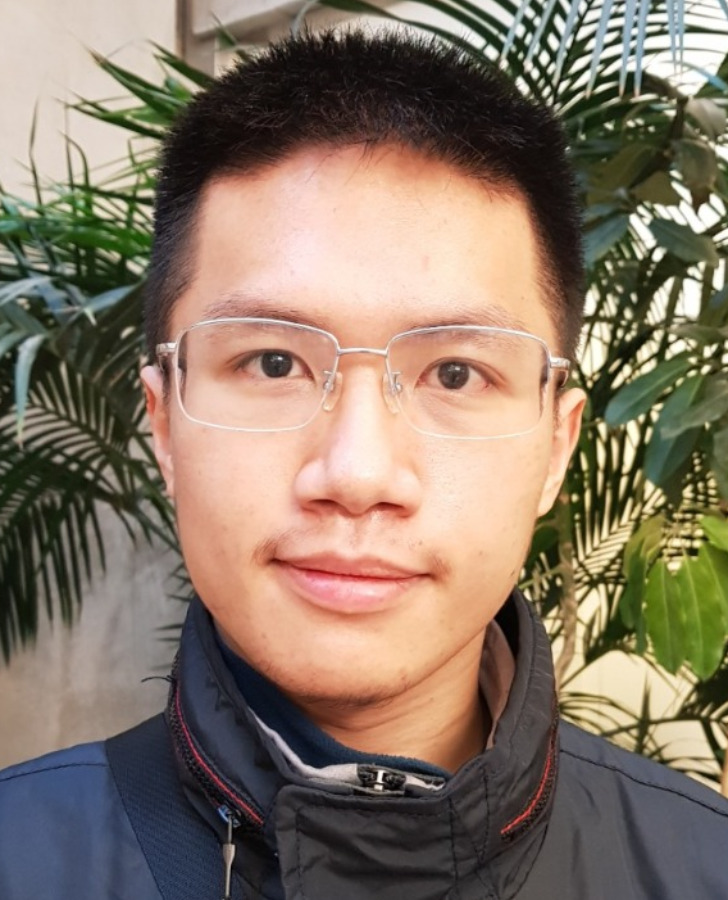

::: {.hero}
::: {.hero-copy}

NLP · Multilingual Learning · LLM Evaluation

# Nghia Trung Ngo

Ph.D. student in Computer Science at the University of Oregon, advised by Prof. Thien Huu Nguyen.

I study learning and evaluation in generalized settings, with a focus on domain adaptation, multilingual learning, multi-task learning, and the behavior of large language models in practical environments. My recent work centers on multilingual benchmarks, retrieval-augmented generation, and evaluation settings that better reflect noisy, real-world use.

  <a class="hero-link hero-link-primary" href="files/nghia-trung-ngo-cv.pdf">Download CV</a>
  <a class="hero-link" href="research.qmd">Research Overview</a>
  <a class="hero-link" href="https://scholar.google.com/citations?hl=en&user=VARfksAAAAAJ&view_op=list_works&sortby=pubdate">Google Scholar</a>

:::
::: {.profile-shell}
{.profile-shot fig-alt="Portrait of Nghia Trung Ngo"}
:::
:::

::: {.metric-row}
::: {.metric}
### Affiliation

University of Oregon
:::
::: {.metric}
### Focus

Generalized NLP and LLM evaluation
:::
::: {.metric}
### Current Areas

Medical RAG, multilingual integration, reasoning benchmarks
:::
:::

## Research Themes

::: {.pill-list}
Domain adaptation for information extraction
Multilingual and multi-task learning
LLM benchmarking and evaluation
Retrieval-augmented generation
Robust AI systems in practical settings
:::

## Current Directions

::: {.card-grid}
::: {.section-card}
### Medical RAG Reliability

[MedRGB](https://arxiv.org/abs/2411.09213) is a benchmarking framework that evaluates medical RAG systems across four practical scenarios — Standard-RAG, Sufficiency, Integration, and Robustness — going beyond accuracy to assess reliability under noise, insufficient evidence, and adversarial misinformation.
:::
::: {.section-card}
### Multilingual Knowledge Integration

My recent work examines how multilingual systems combine knowledge from distinct language and cultural sources, rather than treating translation as a sufficient evaluation proxy. This includes [mSCoRe](https://arxiv.org/pdf/2508.10137), a benchmark for skill-based commonsense reasoning across 5 languages and 10 reasoning skills.
:::
::: {.section-card}
### Harder Reasoning Benchmarks

I am interested in benchmarks that scale with model capability. [mSCoRe](https://arxiv.org/pdf/2508.10137) introduces dynamic complexity scaling (L0–L3) across 10 reasoning skills. [ESV-RAG](projects.qmd) extends this to multi-hop QA through MCTS-guided Explore–Solve–Verify planning.
:::
:::

## Selected Publications

::: {.pub-list}
::: {.pub-item}
### [mSCoRe: a Multilingual and Scalable Benchmark for Skill-based Commonsense Reasoning](https://arxiv.org/pdf/2508.10137)

**Nghia Trung Ngo**, Franck Dernoncourt, Thien Huu Nguyen  
*LREC-COLING 2026*
:::
::: {.pub-item}
### [MedRGB: Practical Framework for Benchmarking Medical Retrieval-Augmented Generation Systems](https://arxiv.org/abs/2411.09213)

**Nghia Trung Ngo**, Chien Van Nguyen, Franck Dernoncourt, Thien Huu Nguyen  
*AAAI 2026 Workshop on AI for Scientific Research*
:::
::: {.pub-item}
### [ChatGPT Beyond English: Towards a Comprehensive Evaluation of Large Language Models in Multilingual Learning](https://aclanthology.org/2023.findings-emnlp.878)

Viet Dac Lai, **Nghia Trung Ngo**, Amir Pouran Ben Veyseh, Hieu Man, Franck Dernoncourt, Trung Bui, Thien Huu Nguyen  
*Findings of EMNLP 2023*
:::
::: {.pub-item}
### [CulturaX: A Cleaned, Enormous, and Multilingual Dataset for Large Language Models in 167 Languages](https://aclanthology.org/2024.lrec-main.377)

Thuat Nguyen, Chien Van Nguyen, Viet Dac Lai, Hieu Man, **Nghia Trung Ngo**, Franck Dernoncourt, Ryan A. Rossi, Thien Huu Nguyen  
*LREC-COLING 2024*
:::
::: {.pub-item}
### [Unsupervised Domain Adaptation for Event Detection using Domain-specific Adapters](https://aclanthology.org/2021.findings-acl.351/)

**Nghia Trung Ngo**, Duy Phung, Thien Huu Nguyen  
*Findings of ACL-IJCNLP 2021*
:::
:::

[View full publication list](publications.qmd){.hero-link}

## Awards and Service

::: {.card-grid}
::: {.section-card}
### Awards

- Lorry I. Lokey Interdisciplinary Science Initiative Dissertation Scholarship, University of Oregon, 2025
- Erwin & Gertrude Juilfs Scholarship in Computer Science, University of Oregon, 2023
:::
::: {.section-card}
### Reviewing

ACL, NAACL, EMNLP, AAAI, ICLR, NeurIPS, COLING, and COLM.
:::
:::

## Writing

The blog is where I plan to write shorter research notes on multilingual evaluation, medical RAG, benchmark design, and the transition from domain adaptation work toward LLM evaluation.

[Read the blog](blog.qmd){.hero-link .hero-link-primary}
